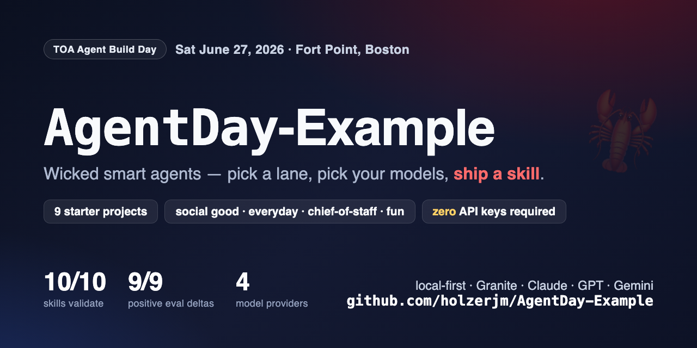

<p align="center">
  
</p>

# AgentDay-Example

[](LICENSE)


[](https://agentskills.io)


**Starter agents + skills for [TOA Agent Build Day](https://github.com/holzerjm) · Saturday, June 27, 2026 · TOA Boston, Fort Point**

*Wicked Smart Agents: pick a lane, pick your models, ship a skill.*

Nine fork-ready agent projects across five themes. Every one ships the full
kit the judging rubric asks for: a working agent, an
[agentskills.io](https://agentskills.io)-spec skill that validates, the house
eval harness with **measured** with-vs-without-skill numbers, a filled
model-selection rationale, and a worked ADLC worksheet. Fork one, make it
yours, demo by 5 PM.

**All nine run with zero API keys on a local model. Four need no network at
all.** Wifi dies, demos don't.

## 60-second start

```bash
git clone https://github.com/holzerjm/AgentDay-Example && cd AgentDay-Example
uv sync
ollama pull granite4:micro                 # ~2 GB local model (or Podman AI Lab — docs/SETUP.md)
uv run python tests/manual_loop_smoke.py   # SMOKE PASS = you're ready
uv run python projects/everyday/fridge-whisperer/agent.py \
  "I have chicken thighs, broccoli, and rice. Plan 3 dinners for 2 people."
```

## Pick your project

| Project | Theme | Lane | Diff | Offline? | Keys | External APIs | You'll learn | Measured skill delta* |
|---|---|---|---|---|---|---|---|---|
| [fridge-whisperer](projects/everyday/fridge-whisperer/) | everyday | L1 | 🦞 | fully | none | none | the agent loop + skill templating — gentlest start | +0.67 (2/3 vs 0/3) |
| [dungeon-mastah](projects/fun/dungeon-mastah/) | fun | L1 | 🦞 | fully | none | none | tested scripts (real dice), save-state memory | +0.67 (2/3 vs 0/3) |
| [wicked-smaht-bahtendah](projects/fun/wicked-smaht-bahtendah/) | fun | L1 | 🦞 | fixtures | none | TheCocktailDB (free) | defaults-not-menus (zero-proof default), API fallback | +1.00 (3/3 vs 0/3) |
| [qrious-citizen](projects/social-good/qrious-citizen/) | social good | L1 | 🦞🦞 | fixtures | none | Analyze Boston CKAN | multi-tool loops, civic-brief skill, real open data | +1.00 (3/3 vs 0/3) |
| [storm-ready](projects/social-good/storm-ready/) | social good | L1 | 🦞🦞 | fixtures | none | NWS api.weather.gov | two-step APIs, degrade-gracefully design, all-clear mode | +1.00 (3/3 vs 0/3) |
| [paypah-trail](projects/everyday/paypah-trail/) | everyday | L1 | 🦞🦞 | fully | none | none | deterministic scripts > model willpower; privacy-first | +1.00 (3/3 vs 0/3) |
| [skill-forge](projects/wildcards/skill-forge/) | wildcard | L1 | 🦞🦞 | fully | none | none | the skill spec, by building the skill that writes skills | +1.00 (3/3 vs 0/3) |
| [model-matchmakah](projects/wildcards/model-matchmakah/) | wildcard | L1 | 🦞🦞 | partial† | optional frontier | none | cascade routing with cost/latency receipts | +1.00 (3/3 vs 0/3) |
| [chief-of-stuff](projects/chief-of-staff/chief-of-stuff/) | chief of staff | **L3** | 🦞🦞🦞 | fully (all-local mode) | optional frontier + Tavily | RSS (cached) | hub-and-spoke delegation, per-task routing, OpenClaw/ZeroClaw deploy | +1.00 (3/3 vs 0/3) |

\* eval pass-rate, with-skill vs without-skill, measured on **granite4:micro
(a 3B local model)** — see each project's `evals/benchmark.json`. Honest
numbers: where the 3B ceiling shows, the ADLC worksheet says so and names
the fix.
† the cascade runs local-only, but demonstrating real escalation needs one
frontier key.

**Pick by vibe:** want useful → everyday · want impact → social good · want
ambitious → chief-of-stuff (Lane 3) · want laughs → fun · want rubric
mastery → wildcards. Lane 2 (improve BriefingClaw)? → [docs/LANE2-PLAYBOOK.md](docs/LANE2-PLAYBOOK.md).

## What's inside every project

```
projects/<theme>/<name>/
├── agent.py            # plain `python agent.py "task"` works; --no-skill, --offline
├── skills/<skill>/     # SKILL.md (validates), optional scripts/ references/ assets/
├── evals/evals.json    # the house method: with vs without skill → benchmark.json
├── fixtures/           # every network tool has an offline fallback
└── docs/               # MODEL_SELECTION.md + ADLC.md — filled, with real numbers
```

The shared harness is [`agentkit/`](agentkit/) — four readable modules
(~450 lines total, zero framework magic) that ARE the curriculum:
`llm.py` (one OpenAI-SDK client → local/Anthropic/OpenAI/Gemini via one env
var), `loop.py` (the agent loop: @tool, load_skill, run_agent), `route.py`
(cascade routing), `evals.py` (assertion engine → benchmark.json). Read them
before the event; fork them during it.

## Findings you can reuse (measured here, on a 3B local model)

- **Skills make small models fast, not just correct** — without an output
  template the model rambles: no-skill runs were consistently slower
  (up to ~2×) across projects.
- **The skill is a hallucination guard** — chief-of-stuff's no-skill baseline
  invented a Saturday client meeting; the "calendar is truth" gotcha
  measurably stopped it (`not_regex` green across all runs).
- **Deterministic work belongs in scripts** — paypah-trail's parser is
  script-perfect on every receipt while the no-skill model silently dropped a
  duplicate. Dice, parsing, validation: code, not willpower.
- **Zero-arg tools are the reliable shape** for 3B-class models; sentence-shaped
  tool results beat bare values.

## The rubric, mapped

| Points | Criterion | Where this repo helps |
|---|---|---|
| 25 | Shippability & spec | every skill passes `agentskills validate`; MIT; runs from README |
| 20 | ADLC | worked worksheets with real iteration logs; the eval loop is wired |
| 20 | Model Selection | filled rationale docs; `agentkit.route` implements cascading; run footers print tokens/$/latency |
| 20 | Lane merit | L1 ×8, L3 flagship, L2 playbook |
| 15 | Skill quality | trigger-rich descriptions, defaults, gotchas, output templates — and measured deltas |

## Docs

[Setup (local models + keys)](docs/SETUP.md) ·
[Deployment tracks: bare Python / OpenClaw / ZeroClaw](docs/DEPLOYMENT-TRACKS.md) ·
[Lane 2 playbook (fork BriefingClaw)](docs/LANE2-PLAYBOOK.md) ·
[Ten more project ideas](docs/ideas-appendix.md) ·
[Printable cheat sheet (PDF)](docs/cheat-sheet.pdf) ·
[Templates](templates/)

Reference architecture for the event:
[BriefingClaw](https://github.com/holzerjm/GACEP-Spring-2026-demo) — the
8-agent hub-and-spoke briefing system chief-of-stuff is modeled after.

MIT licensed. Fork loudly, name punnily, demo the loop — not the output.
